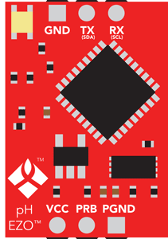
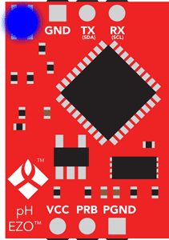
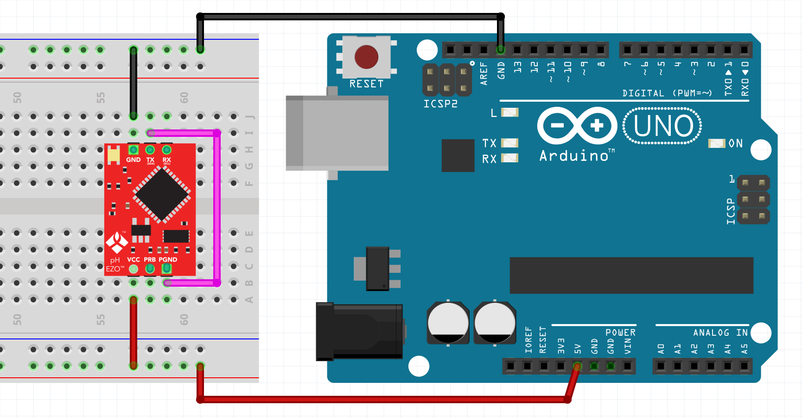

# How to switch to I2C

Most EZO Circuits come with two protocols: UART and I2C. Factory default is UART, at a baudrate of 9600.

```
The Whitebox T3 for Raspberry Pi is compatible with the I2C protocol only.
```

### Distinguish the protocols

#### UART



* Green LED
* When taking a reading: Cyan blink
* (every second in continuous mode - the factory setting)
* UART Factory Setting: 9600,8,N,1

#### I2C



* Blue LED
* When taking a reading: Cyan blink
* I2C Factory Settings I2C Address:
    - EZO DO: 97 (0x61)
    - EZO ORP: 98 (0x62)
    - EZO pH: 99 (0x63)
    - EZO EC: 100 (0x64)
    - EZO RTD: 102 (0x66)
    - EZO PMP: 103 (0x67)
    - EZO CO2: 105 (0x69)
    - EZO PRS: 106 (0x6A)
    - EZO O2: 108 (0x6c)
    - EZO HUM: 111 (0x6F)
    - EZO RGB: 112 (0x70)

#### Set Protocol Manually

This procedure toggles the protocol between UART and I2C. If the EZO Circuit is in UART mode, this procedure will switch it to I2C. If it is in I2C mode, it will switch it to UART.

> Before starting the procedure, remove the EZO Circuit from the Tentacle (or other carrier boards). Remove power and all connections.

```
This procedure is easiest using a breadboard and a set of jumper wires
```

1. Connect (shortcut) these two pins:
    - PGND pin to the TX pin if your circuit is EZO pH, EZO DO, EZO ORP or EZO EC
    - Only exception is EZO RTD: Short the PRB pin to the TX pin instead.
    - Power the EZO Circuit (GND, +5V)
    - Wait for LED to change from green to blue (UART->I2C) or from blue to green (I2C->UART). 


> (The Arduino is used as a power source only. You can connect any other power source (3.3V-5V))

1. Remove the jumper wire from the PGND (or PRB respectively) pin to the TX pin
2. Remove power (GND, 5V)

```
The device is now using the new protocol (repeat above steps to toggle back to the other protocol)
```
